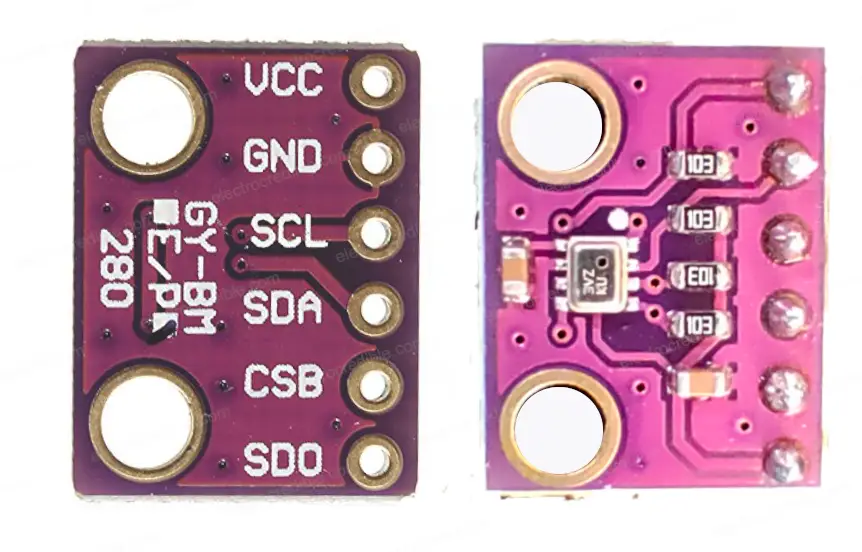

# MicroPython driver for BMP280 over I2C

MicroPython driver for BMP280 temperature and pressure sensor over I2C interface.


## Hardware

-   [BMP280 Datasheet](docs/bst-bmp280-ds001.pdf)

## Software

-   [MicroPython](https://micropython.org/download/RPI_PICO/) - Pico firmware (RP2 port)

## Installation

-   Copy the `bmp280.py` file or `lib` folder to the root of your MicroPython device filesystem.

## API Interface

### `BMP280`

-   `BMP280(i2c, i2c_address, configuration)`

    -   `i2c`: An instance of the I2C interface.
    -   `i2c_address`: The I2C address of the sensor (default: `0x76`).
    -   `configuration`: configuration object (default: `BMP280Configuration()`).

-   `get_measurements() -> tuple[float, float]` - reads both temperature in Celsius and pressure in hPa.

-   `get_temperature() -> float` - reads temperature in Celsius.

-   `get_pressure() -> float` - reads pressure in hPa.

### `BMP280Configuration`

-   `BMP280Configuration(power_mode, temperature_oversampling, pressure_oversampling, filter_coefficient, standby_time)`

    -   `power_mode`
        -   `BMP280PowerMode.NORMAL`
        -   `BMP280PowerMode.SLEEP`
        -   `BMP280PowerMode.FORCED` (default)
    -   `temperature_oversampling`:
        -   `TEMPERATURE_OVERSAMPLING_SKIP`
        -   `TEMPERATURE_OVERSAMPLING_X1` (default)
        -   `TEMPERATURE_OVERSAMPLING_X2`
        -   `TEMPERATURE_OVERSAMPLING_X4`
        -   `TEMPERATURE_OVERSAMPLING_X8`
        -   `TEMPERATURE_OVERSAMPLING_X16`
    -   `pressure_oversampling`
        -   `PRESSURE_OVERSAMPLING_SKIP`
        -   `PRESSURE_OVERSAMPLING_X1` (default)
        -   `PRESSURE_OVERSAMPLING_X2`
        -   `PRESSURE_OVERSAMPLING_X4`
        -   `PRESSURE_OVERSAMPLING_X8`
        -   `PRESSURE_OVERSAMPLING_X16`
    -   `filter_coefficient`
        -   `FILTER_COEFFICIENT_OFF` (default)
        -   `FILTER_COEFFICIENT_2`
        -   `FILTER_COEFFICIENT_4`
        -   `FILTER_COEFFICIENT_8`
        -   `FILTER_COEFFICIENT_16`
    -   `standby_time`
        -   `STANDBY_TIME_0_5_MS`
        -   `STANDBY_TIME_62_5_MS`
        -   `STANDBY_TIME_125_MS`
        -   `STANDBY_TIME_250_MS`
        -   `STANDBY_TIME_500_MS`
        -   `STANDBY_TIME_1000_MS` (default)
        -   `STANDBY_TIME_2000_MS`
        -   `STANDBY_TIME_4000_MS`

## Code examples

Working code example can be found in [main.py](main.py) file.

```py
from machine import Pin, I2C
from bmp280 import BMP280

i2c = I2C(0, scl=Pin(9), sda=Pin(8))
sensor = BMP280(i2c=i2c)
print(sensor.read_measurements())  # (temperature, pressure)
```

# Acknowledgements

-   [flrrth](https://github.com/flrrth) @ [https://github.com/flrrth/pico-bmp280](https://github.com/flrrth/pico-bmp280) - for the inspiration
